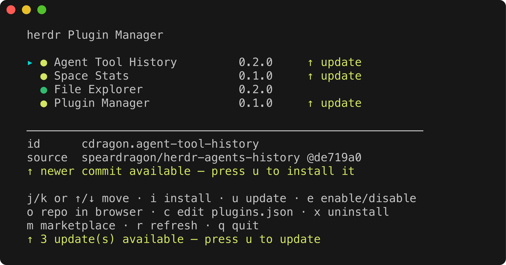
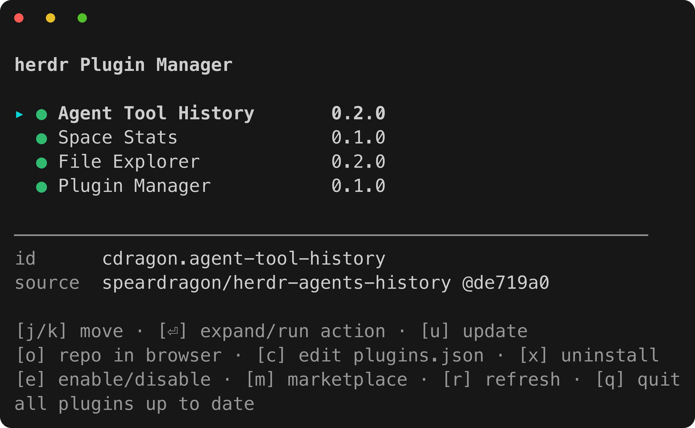
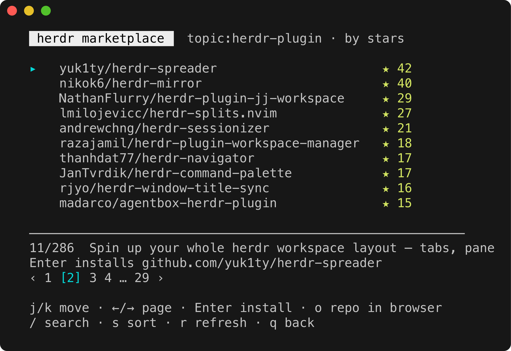

# herdr-plugin-manager




🇰🇷 한국어 | [🇺🇸 English](#english)

**[herdr](https://herdr.dev) 플러그인을 popup 하나로 관리하는 플러그인.** 모든 pane에 에이전트를 띄워두고 일할 때, 플러그인 하나 설치하자고 새 탭을 열고 `herdr plugin ...` 명령어를 기억해낼 필요가 없다 — 키 한 번이면 popup이 뜨고, 거기서 설치·업데이트·삭제·enable/disable·마켓플레이스 탐색까지 전부 끝난다.

내부적으로는 전부 `herdr plugin` CLI를 그대로 호출하는 얇은 TUI다 (bash + python3, 외부 의존성 없음).

## 빠른 시작

```bash
herdr plugin install speardragon/herdr-plugin-manager
```

herdr 설정(`~/.config/herdr/config.toml`)에 키바인딩 추가 — **추천 키는 `prefix+p`** (**p**lugin):

```toml
[[keys.command]]
key = "prefix+p"
type = "plugin_action"
command = "ray.plugin-manager.open"
description = "open plugin manager"
```

`herdr server reload-config` 실행 후 아무 pane에서나 `prefix+p`를 누르면 popup이 뜬다.

## 키



| 키 | 동작 |
|----|------|
| `j` / `k` / `↑` / `↓` | 이동 (선택된 항목의 상세가 하단에 표시) |
| `Enter` | **플러그인 행**: 액션 목록 펼치기/접기 (아코디언, `›`/`⌄` 표시) · **액션 행**: 그 액션 즉시 실행 |
| `u` | 업데이트 — 선택한 플러그인을 최신으로. herdr에 update 명령은 없고 설치본이 커밋 sha에 고정되므로, 같은 spec으로 `install`을 재실행하는 방식 |
| `e` | enable ↔ disable 토글 |
| `x` | 삭제 — `y/N` 확인 후 uninstall (로컬 링크 플러그인이면 unlink) |
| `o` | 선택한 플러그인의 GitHub repo를 브라우저로 열기 (subdir 플러그인은 설치된 커밋의 해당 subdir로 이동) |
| `c` | 전역 플러그인 레지스트리 `~/.config/herdr/plugins.json`을 VS Code로 열기 (`code` CLI 필요) |
| `m` | **마켓플레이스** — 커뮤니티 플러그인 탐색 (아래 참조) |
| `r` | 목록 새로고침 (업데이트 재확인 포함) |
| `q` / `Esc` | 닫기 |

### 액션 아코디언 (`Enter`)

액션을 선언한 플러그인은 행 끝에 `›` 표시가 붙는다. `Enter`로 펼치면 액션들이 `↳ id — 제목` 형태로 아래에 나열되고, 액션 행에서 다시 `Enter`를 누르면 **popup이 닫히면서 그 액션이 실행**된다 (`herdr plugin action invoke` — 키바인딩으로 호출하는 것과 동일한 경로). popup을 먼저 닫는 이유: pane/popup을 여는 액션은 popup이 떠 있는 동안 herdr가 거부하기 때문에, 분리된 헬퍼가 popup 종료를 기다렸다가 실행한다.

액션 행에는 herdr 설정(`config.toml`의 `[[keys.command]]`)에 **바인딩된 단축키**(`prefix+p` 등)가 함께 표시되고, 하단 상세에는 바인딩 여부와 그 액션이 실행하는 커맨드까지 보인다:

```
  ▸ ● Plugin Manager           0.1.0    ⌄
       ↳ open           Open plugin manager        prefix+p
    ● Space Stats              0.1.0    ›
  ──────────────────────────────────────────
  action  ray.plugin-manager.open
  key     prefix+p
  cmd     bash -c exec "${HERDR_BIN_PATH:-herdr}" plugin pane ope…
```

바인딩이 없는 액션은 `key — not bound`로 표시된다 — 자주 쓰는 액션이면 config.toml에 키를 달라는 신호다.

### 표시등 (● / ○)

| 표시 | 의미 |
|------|------|
| 🟢 `●` | enabled · 최신 상태 |
| 🟡 `●` `↑ update` | enabled · GitHub 원본에 더 새 커밋이 있음 → `u`로 업데이트 |
| ⚪ `○` `(disabled)` | disabled |

popup을 열면 목록이 즉시 그려지고, 곧이어(≈0.5초) 각 GitHub 플러그인의 설치 커밋 sha를 `git ls-remote`로 원격 최신 커밋과 비교해 표시등을 초록/노랑으로 확정한다. 로컬 링크(`herdr plugin link`) 플러그인은 업데이트 확인과 `u` 대상에서 제외된다 — 로컬 checkout에서 직접 갱신하면 된다.

### 자동 영문 전환 (macOS)

herdr의 `switch_ascii_input_source_in_prefix` 옵션처럼, **popup이 열릴 때 입력소스가 한글 등 비-ASCII IME면 자동으로 영문 자판으로 전환**해 단일 키 조작이 바로 먹게 하고, **popup이 닫히면 원래 입력소스로 복원**한다. macOS의 Text Input Source API를 osascript(JXA)로 호출하므로 별도 설치가 필요 없다. 복원은 popup 프로세스를 감시하는 분리된 watchdog이 수행해서 `q`/`Esc`는 물론 pane이 강제로 닫혀도 동작한다. 끄려면 `HERDR_PM_ASCII_INPUT=0`을 popup 환경변수로 넘기면 된다.

## 마켓플레이스 (`m`)



[herdr.dev/plugins](https://herdr.dev/plugins/)와 같은 인덱스 — GitHub에서 `herdr-plugin` topic이 붙은 공개 저장소를 보여준다 (herdr.dev 페이지 자체가 이 topic의 자동 인덱스라서, 원본인 GitHub Search API를 직접 조회한다). 10개씩 페이지로 나뉘고 하단에 `‹ 1 … 4 [5] 6 … 29 ›` 페이지 바가 표시된다. 데이터는 API에서 50개 단위로 필요한 페이지만 가져온다 (검색 API 상한 1000개).

| 키 | 동작 |
|----|------|
| `j` / `k` / `↑` / `↓` | 항목 이동 (페이지 경계를 넘으면 자동으로 다음/이전 페이지) |
| `←` / `→` (또는 `h` / `l`) | **페이지 넘기기** (끝에서 wrap) |
| `/` | **검색** — 입력한 단어로 GitHub API에 재질의 (`topic:herdr-plugin + 검색어`). 로드된 목록만 거르는 게 아니라 topic 전체의 이름·설명·README를 검색한다. 빈 입력 = 전체 목록으로 복귀 |
| `s` | **정렬 토글** — 별점순(stars) ↔ 최근 업데이트순(updated) |
| `Enter` | **선택한 플러그인 바로 설치** (`herdr plugin install owner/repo --yes`). 이미 설치된 항목(`✓`)은 안내만 표시 |
| `o` | 해당 repo를 브라우저로 열기 |
| `r` | 현재 검색·정렬 기준으로 처음부터 다시 가져오기 |
| `q` / `Esc` / `m` | 설치된 플러그인 목록으로 돌아가기 |

현재 검색어와 정렬 기준은 헤더에 표시된다 (예: `"viewer" · by updated`). 네트워크가 없거나 GitHub API rate limit(비인증 검색 분당 10회)에 걸리면 실패 안내가 뜨고, 커서와 로드된 목록은 그대로 유지된다. 일부 저장소는 플러그인이 subdir에 있어 루트 설치가 실패할 수 있는데, 그 경우 `o`로 repo를 열어 README의 설치 경로를 확인한 뒤 `herdr plugin install owner/repo/subdir --yes`를 직접 실행하면 된다 (popup에는 설치 기능이 없다 — 설치는 마켓플레이스의 `Enter`를 통해서만 한다).

## Dry-run 모드

실제 명령을 실행하지 않고 어떤 명령이 실행될지만 보여주는 모드. 검증·데모용.

```bash
herdr plugin pane open --plugin ray.plugin-manager --entrypoint manager \
  --placement popup --focus --env HERDR_PM_DRY_RUN=1
```

install / update / uninstall / enable / disable / repo 열기 / plugins.json 열기가 전부 `[dry-run] ...` 출력으로 대체된다. 목록 조회·업데이트 확인 같은 읽기 동작은 그대로 실행된다.

## 요구 사항

- herdr 0.7.4+
- `python3` (macOS 기본 포함 — JSON 파싱에만 사용)
- `git` (선택 — 업데이트 표시등용. 없으면 표시등만 생략)
- `curl` (macOS 기본 포함 — 마켓플레이스 조회용)
- 브라우저 오프너 (`o` 키용 — macOS `open` / Linux `xdg-open`)
- `code` CLI (선택 — `c` 키용. VS Code에서 "Shell Command: Install 'code' command" 실행)

## 개발

```bash
herdr plugin link /path/to/herdr-plugin-manager   # 로컬 개발용 링크
herdr plugin action invoke ray.plugin-manager.open
```

TUI 로직은 herdr popup 없이도 PTY에서 직접 테스트할 수 있다:

```bash
HERDR_PM_DRY_RUN=1 bash bin/manager.sh
```

### 구조

- `herdr-plugin.toml` — popup pane(`manager`) + workspace action(`open`) 선언
- `bin/manager.sh` — TUI 본체 (bash 3.2 호환 · 설치 목록/마켓플레이스 2개 뷰 · 버퍼 단일 출력 방식의 flicker-free 렌더링)
- `bin/parse_list.py` — `herdr plugin list --json` → 탭 구분 행 변환
- `bin/parse_market.py` — GitHub Search API 응답 → 탭 구분 행 변환

---

## English

**Manage [herdr](https://herdr.dev) plugins from a single popup.** When every pane is running an AI agent, you shouldn't have to open a new tab and remember `herdr plugin ...` incantations just to install something — one keypress opens a popup where you install, update, remove, toggle, and browse the marketplace.

Under the hood it's a thin TUI over the `herdr plugin` CLI (bash + python3, zero external dependencies).

### Quick start

```bash
herdr plugin install speardragon/herdr-plugin-manager
```

Add a keybinding to `~/.config/herdr/config.toml` — the **recommended key is `prefix+p`** (**p**lugin):

```toml
[[keys.command]]
key = "prefix+p"
type = "plugin_action"
command = "ray.plugin-manager.open"
description = "open plugin manager"
```

Run `herdr server reload-config`, then press `prefix+p` in any pane.

### Keys

| Key | Action |
|-----|--------|
| `j` / `k` / `↑` / `↓` | Move selection (details of the selected item shown below the list) |
| `Enter` | On a **plugin row**: fold/unfold its declared actions (accordion, `›`/`⌄`) · on an **action row**: run that action immediately via `herdr plugin action invoke`. Action rows show the key bound to them in your herdr config (e.g. `prefix+p`), and the detail pane shows the binding plus the command the action runs |
| `u` | Update the selected plugin — herdr has no update command; installs are pinned to a commit sha, so re-running `install` with the same spec moves the pin to latest |
| `e` | Toggle enable ↔ disable |
| `x` | Uninstall after a `y/N` confirm (locally linked plugins are unlinked instead) |
| `o` | Open the plugin's GitHub repo in your browser (subdir plugins open the subdir at the installed commit) |
| `c` | Open the global plugin registry `~/.config/herdr/plugins.json` in VS Code (needs the `code` CLI) |
| `m` | **Marketplace** — browse community plugins (below) |
| `r` | Refresh the list (re-checks updates) |
| `q` / `Esc` | Close |

**Indicators:** 🟢 `●` enabled & up to date · 🟡 `●` `↑ update` — a newer commit exists on the GitHub source (press `u`) · ⚪ `○` disabled. The list paints instantly; update status settles ~0.5s later by comparing each plugin's pinned sha against the remote via `git ls-remote`. Locally linked plugins are excluded from update checks.

**Auto ASCII input (macOS):** like herdr's `switch_ascii_input_source_in_prefix`, opening the popup on a non-ASCII input source (e.g. a Korean IME) switches to your last-used ASCII layout so the single-key TUI works immediately, and the original source is restored when the popup closes — by a detached watchdog, so it works even if the pane is force-closed. Uses the Text Input Source API via osascript (JXA), no extra installs. Disable with `HERDR_PM_ASCII_INPUT=0`.

### Marketplace (`m`)

The same index as [herdr.dev/plugins](https://herdr.dev/plugins/) — public GitHub repos tagged with the `herdr-plugin` topic, queried straight from the GitHub Search API. Results are browsed in pages of 10 with a `‹ 1 … 4 [5] 6 … 29 ›` page bar at the bottom; the API is fetched 50 at a time, only for the pages you actually visit (up to the search API's 1000-result cap).

`j`/`k` move (crossing a page boundary flips automatically) · `←`/`→` (or `h`/`l`) flip pages, wrapping at the ends · `/` **searches** by re-querying the API (`topic:herdr-plugin + your terms` — matches name/description/readme across the whole topic, not just loaded rows; empty input returns to the full listing) · `s` toggles the sort between most-starred and most-recently-updated · **Enter installs the selection** (`herdr plugin install owner/repo --yes`; already-installed repos show a `✓`) · `o` opens the repo in your browser · `r` re-fetches with the current query/sort · `q` goes back. The active query and sort are shown in the header; a failed fetch keeps the cursor and loaded list intact.

### Dry-run mode

```bash
herdr plugin pane open --plugin ray.plugin-manager --entrypoint manager \
  --placement popup --focus --env HERDR_PM_DRY_RUN=1
```

Every mutating action prints the exact command instead of running it; read-only actions still work.

### Requirements

herdr 0.7.4+ · `python3` (JSON parsing) · `git` (optional, update indicators) · `curl` (marketplace) · `open`/`xdg-open` (the `o` key) · `code` CLI (optional, the `c` key).

### Development

```bash
herdr plugin link /path/to/herdr-plugin-manager
herdr plugin action invoke ray.plugin-manager.open
HERDR_PM_DRY_RUN=1 bash bin/manager.sh   # test the TUI in any terminal, no popup needed
```
